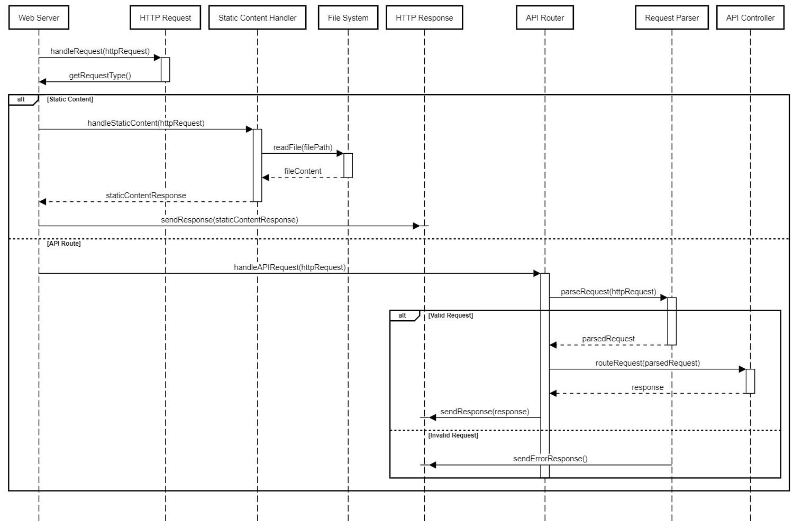

# Basic HTTP Web Server

This is a basic multithreaded HTTP web server written in Java using Maven. The server listens on the default port 8080 and provides a simple response to incoming requests. It can serve static content and route API calls to specific methods. The web server will be designed to handle concurrent requests efficiently and provide a scalable and reliable solution.

## Prerequisites
- Java Development Kit (JDK) 1.8 installed
- Maven installed

## Getting Started
1. Clone the repository:
git clone https://github.com/ravisarojjnu/webserver.git

2. Navigate to the project directory:
cd webserver

3. Build the project using Maven:
mvn clean package

4. Run the server:
    `java -jar target/httpwebserver-0.0.1-SNAPSHOT-jar-with-dependencies.jar`
5. or, Run the server:
`java -jar target/httpwebserver-0.0.1-SNAPSHOT-jar-with-dependencies.jar -p 8080 -t 100`
    - where p is port. default is 8080
    - and, t is number of threds to handle requests. default is 5
6. The server is now running and listening on port 8080. You can access it by opening a web browser and entering `http://localhost:8080` in the address bar.

## Server Functionality
- When a client connects to the server, it reads the request line.
- The server generates a simple HTTP response.
- The response is sent back to the client.

## Customization
- You can modify the server code located in the `src/main/java` directory to add more functionality or customize the response logic.
- After making changes, rebuild the project using Maven (`mvn clean package`) and run the server again.

# Design: Web Server in Java

## 1. Architecture Overview
The web server will follow a multi-threaded architecture, where each incoming request will be handled by a separate thread. This approach ensures concurrent processing of requests and prevents blocking of the main server thread. The server will consist of the following components:

## 2.1. Server Initialization
- A main class responsible for initializing and starting the web server.
- The server will listen on a specified port for incoming connections.

### 2.2. Request Handling
- A request handler class that accepts incoming client connections and processes each request.
- Upon receiving a request, the handler will parse the HTTP headers and determine the type of request (API call or static content).
- If it's an API call, the handler will extract the route from the request URL and forward it to the appropriate method for processing.
- If it's a request for static content, the handler will locate and serve the requested file.

### 2.3. API Routing
- A set of classes or annotations to define API routes and associated methods.
- Each API route will be mapped to a specific method that handles the corresponding request.
- The routing mechanism will match the incoming request URL to the registered routes and invoke the appropriate method.

### 2.4. Static Content Serving
- A file handler class responsible for locating and serving static content.
- The server will maintain a root directory where the static files are stored.
- The file handler will receive a request for static content, validate the file path, and return the file's contents if found.

## Implementation Details
### 3.1. Server Initialization
- Create a Java class for the server and implement the necessary methods to start and stop the server.
- Use the Java Socket API to listen for incoming connections on a specified port.
- Create a thread pool to handle the requests
- Submit the request to thread pool for each incoming connection and pass it to the request handler.

### 3.2. Request Handling
- Implement a request handler class that implements the Runnable Interface.
- In the run() method, handle the following steps:
    - Read the incoming request from the client socket.
    - Parse the HTTP headers to determine the request type (GET, POST, etc.).
- If it's an API call:
    - Extract the route from the request URL.
    - Match the route to the appropriate method using the routing mechanism.
    - Invoke the method and send the response back to the client.
- If it's a request for static content:
    - Extract the file path from the request URL.
    - Validate the file path and check if it exists.
    - If the file is found, read its contents and send them back to the client.

### 3.3. API Routing
- Create a routing class that registers API routes and their associated methods.
- Use annotations or a configuration file to map routes to methods.
- Implement a routing mechanism that matches the incoming request URL to the registered routes and invokes the corresponding method.

### 3.4. Static Content Serving
- Implement a file handler class that receives requests for static content.
- Define a root directory where the static files are stored.
- Validate the requested file path and check if it exists within the root directory.
- If the file is found, read its contents and send them back to the client.

## Contributing
Contributions are welcome! If you find any issues or would like to add new features, feel free to open an issue or submit a pull request.

## License
This project is licensed under the [MIT License](LICENSE).